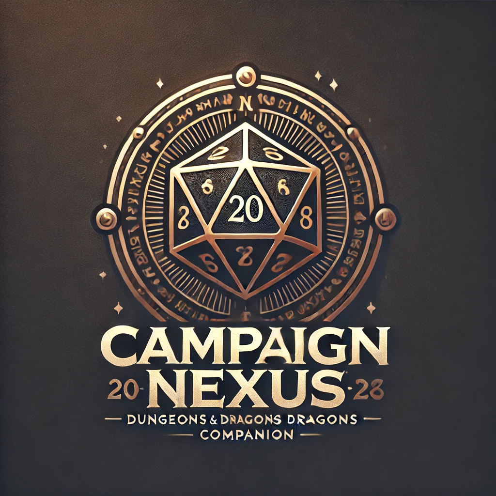
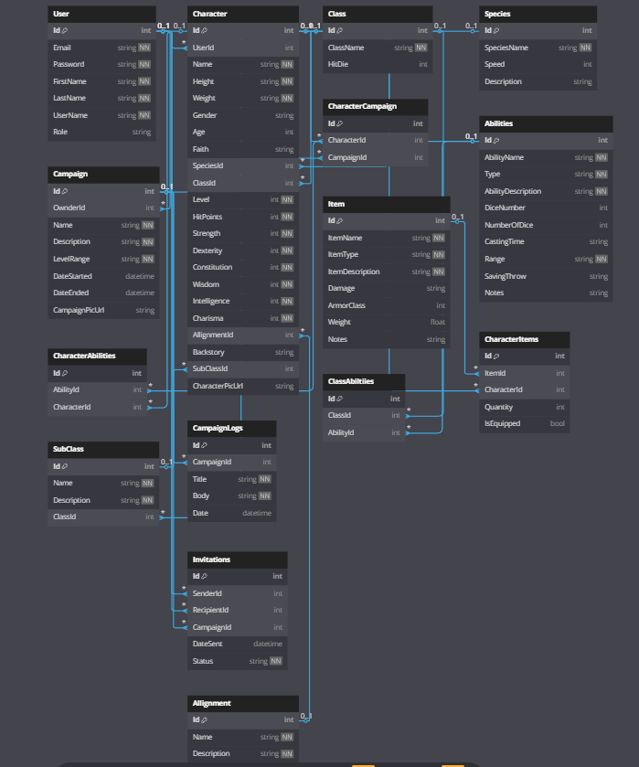

#  Campaign Nexus

## Introduction

CampaignNexus is a Dungeons & Dragons character companion app/campaign manager app that allows users to create characters, level them up, make rolls based on their ability scores, and add them to campaigns that their friends have created.  

## Tech Stack

This project is built using the following technologies:

- **Frontend:** [React](https://react.dev/)

- **Backend:** [C#](https://learn.microsoft.com/en-us/dotnet/csharp/), [ASP.NET Core](https://learn.microsoft.com/en-us/aspnet/core/)
- **Database:** [PostgreSQL](https://www.postgresql.org/)
- **ORM:** [Entity Framework Core](https://learn.microsoft.com/en-us/ef/core/)

## Libraries & Tools

- **Routing:** [React Router DOM](https://reactrouter.com/)
- **UI Framework:** [React Bootstrap](https://react-bootstrap.netlify.app/)
- **Icons:** [Font Awesome](https://fontawesome.com/)
- **Image Hosting:** [Cloudinary](https://cloudinary.com/)

## Requirements

- **Node.js**:
  [Download Node.js](https://nodejs.org/)
- **npm** (comes with Node.js)
- **.NET SDK (8.0)** [Download .NET](https://dotnet.microsoft.com/download)
- **PostgreSQL** [Download PostgreSQL](https://www.enterprisedb.com/downloads/postgres-postgresql-downloads)

To work with migrations and to run commands like dotnet ef database update, you'll need the EF Core tools:

```bash
dotnet tool install --global dotnet-ef --framework net8.0
```

## Setup Instructions

To get started with this project, follow these steps:
//need put migrations folder into gitignore and include initial migration into instructions

### 1. Clone the repository

```bash
git clone git@github.com:Clonchmr/CampaignNexus.git
cd CampaignNexus
```

### 2. Install Dependencies

- **Backend:** Ensure you are in the root directory, and run:

```bash
dotnet restore
```

- **Frontend:** Navigate to the client directory:

```bash
cd client
```

and run:

```bash
npm install
```

### 3. Set up User Secrets

This project uses **user secrets** to store the PostgrSQL connection string, and Admin Password. To configure them for local development:

1. Ensure you are in the root directory, and run:

```bash
dotnet user-secrets set 'CampaignNexusDbConnectionString' 'Host=localhost;Port=5432;Username=<your_postgres_username>;Password=<your_postgresql_password>;Database=CampaignNexus'
```

and then:

```bash
dotnet user-secrets set "AdminPassword" <"Your-Admin-Password">
```

### 4. Database Setup

If this is your first time running the project, you'll need to apply the migrations to setup the database:

```bash
dotnet ef database update
```

### 5. Run the application

- **Frontend:** From the **client** directory:

```bash
npm start
```

- **Backend:** From the **root** directory:

```bash
dotnet run
```

---

## Entity Relationship Diagram



 --- 

## Http Request Methods

  * Get - Will let you get all data or specific data depending on the url.

    * route: https://localhost:5001/api/Character - Get all characters

    * route: https://localhost:5001/api/Character/1 - Get data on a specific character

  * Post - Add data to database, or make simple change like a toggle from true to false
    
    * route: https://localhost:5001/api/Campaign - Creates a new Campaign

    * route: https://localhost:5001/api/Campaign/1/Complete - Assigns a specific campaign a completed on date.

  * Put - Update existing information in the database.
    
    * route: https://localhost:5001/api/Character/update/1 - Updates the Details of a character such as name, backstory, or alignment.

    * route: - https://localhost:5001/api/Character/level/1 - Updates a characters level, along with level specific information such as sub-class or ability scores

* Delete - Deletes a record from the database.

    * route: https://localhost:5001/api/CampaignLog/1 - Deletes a Log from a campaign.

    * route: https://localhost:5001/api/CharacterCampaign - Deletes a relationship between a character and a campaign.

> Note: Some endpoints expect the target entity in the route, and some expect it from the query. Check comments on relevant endpoints for specifics.

### Character:
http methods supported: Get, Post, Put, Delete. 

Example Body: 
```bash
{
  "id": "INT: include on Put only",
  "rollForHp": "Boolean",
  "strength": "Int: on Post must be between 3 and 17",
  "dexterity": "Int: on Post must be between 3 and 17",
  "constitution": "Int: on Post must be between 3 and 17",
  "wisdom": "Int: on Post must be between 3 and 17",
  "intelligence": "Int: on Post must be between 3 and 17",
  "charisma": "Int: on Post must be between 3 and 17",
  "level": "Int: Include on Put only",
  "hitPoints": "Int: Include on Put only",
  "subClassId": "Int: Include on Put only",
  "userId": "Int",
  "name": "String: Not Null",
  "height": "String: Not Null",
  "weight": "String: Not Null",
  "gender": "String: Not Null",
  "age": "Int",
  "faith": "String: Not Null",
  "speciesId": "Int",
  "classId": "Int",
  "alignmentId": "Int",
  "backstory": "String: Not Null",
  "characterPicUrl": "String",
  "characterItems": [ "Include on Post only"
    {
      "id": "Int",
      "itemId": "Int",
      "characterId": "Int",
      "quantity": "Int",
      "isEquipped": "Boolean, defaults to false"
    }
  ],
  "characterAbilities": [ "Include on Post only"
    {
      "abilityId": "Int",
      "characterId": "Int",
    }
  ]
}
```

### Campaign:

http methods supported: Get, Post, Put, Delete

Example Body
```bash
  {
  "id": "Int: Include on Put only",
  "ownerId": "Int",
  "campaignName": "String: Not Null",
  "campaignDescription": "String: Not Null",
  "levelRange": "String: Not Null",
  "startDate": "DateTime: Defaults to todays date",
  "endDate": "DateTime: null by default",
  "campaignPicUrl": "String",
}
```

### CampaignLog: 

http methods supported: Get, Put, Post, Delete

Example body:
```bash
{
  "id": "Int: Include on Put only",
  "campaignId": "Int",
  "title": "String: Not Null",
  "body": "String: Not Null",
  "date": "DateTime: Defaults to todays date."
}
```

### CharacterCampaign: 

http methods supported: Delete

Example url: 'https://localhost:5001/api/CharacterCampaign?characterId=2&campaignId=1'

Deletes a relationship between a character and a campaign

### CharacterItem: 

http methods supported: Post

Example url: 'https://localhost:5001/api/CharacterItem/4' 

"Uses" an item of type "Consumable", and reduces its quantity by 1.

### Class

http methods supported: Get

Example body: 
```bash
  {
    "id": "Int",
    "className": "String",
    "hitDie": "Int",
    "classAbilities": [
      {
        "id": "Int",
        "classId": "Int",
        "abilityId": "Int",
        "ability": {
          "id": "Int",
          "abilityName": "String",
          "abilityType": "String",
          "abilityDescription": "String",
          "diceNumber": "Int",
          "numberOfDice": "Int",
          "castingTime": "String",
          "range": "String",
          "savingThrow": "String",
          "notes": "String"
        }
      ]
    }
```

### Cloudinary: 

http methods supported: Post

Example body:
```bash
  {
    "publicId": "String"
  }
```

### Invite 

http methods supported: Get, Post, Delete

Example body: 
```bash
  {
  "id": "Int Include only on Delete",
  "senderId": "Int",
  "recipientId": "Int",
  "campaignId": "Int",
  "dateSent": "DateTime: Defaults to todays date",
  "status": "String: defaults to 'Pending'"
}
```

### Item

http methods supported: Get, Post

Example body:
```bash
  {
    "id": "Int",
    "itemName": "String",
    "itemType": "String",
    "itemDescription": "String",
    "damage": "String",
    "armorClass": "Int",
    "weight": "double",
    "notes": "String",
  }
```
### Species

http methods supported: Get

Example body:
```bash
   {
    "id": "Int",
    "speciesName": "String",
    "speed": "Int",
    "description": "String"
  }
```

### UserProfile

http methods supported: Get

Example body: 
```bash
  {
    "id": "Int",
    "firstName": "String",
    "lastName": "String",
    "email": "String",
    "userName": "String",
  }
```

 