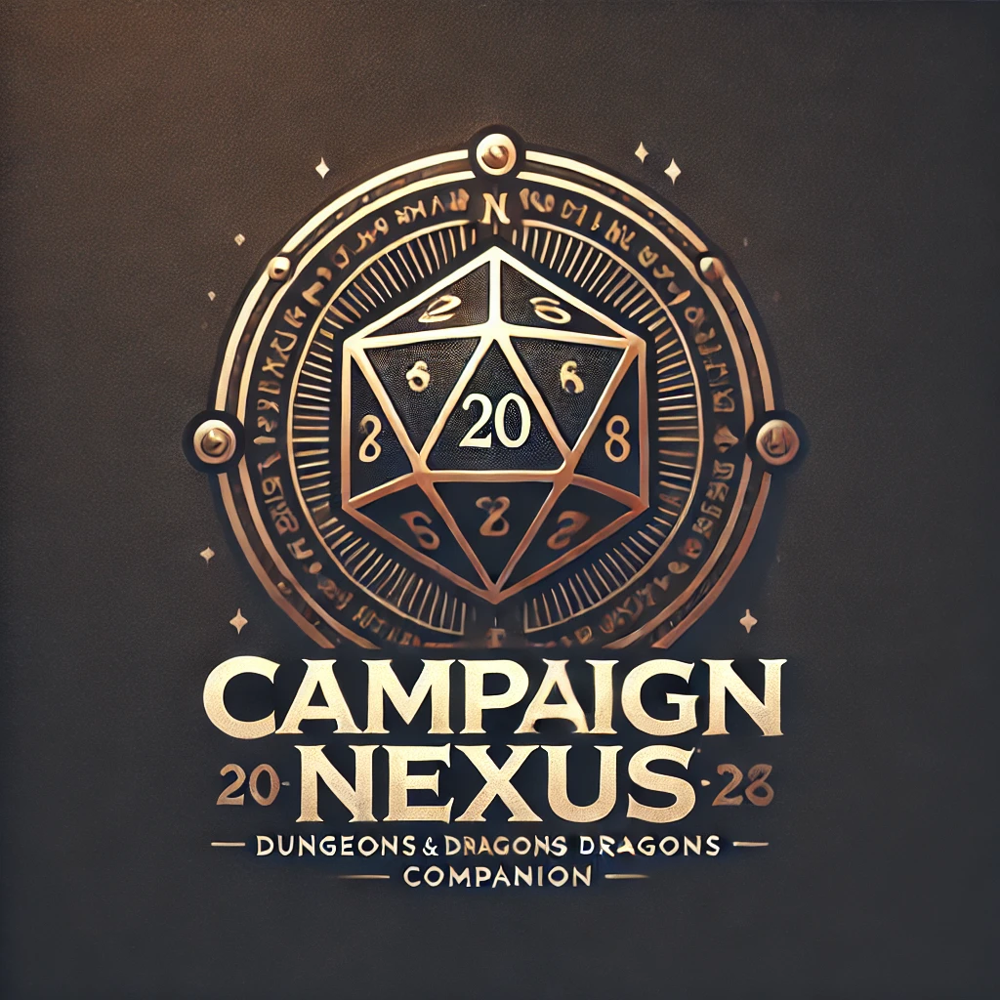

#  Campaign Nexus

## Tech Stack

This project is built using the following technologies:

- **Frontend:** [React]("https://react.dev/")

- **Backend:** [C#]("https://learn.microsoft.com/en-us/dotnet/csharp/"), [ASP.NET Core]("https://learn.microsoft.com/en-us/aspnet/core/")
- **Database:** [PostgreSQL]("https://www.postgresql.org/")
- **ORM:** [Entity Framework Core]("https://learn.microsoft.com/en-us/ef/core/")

## Libraries & Tools

- **Routing:** [React Router DOM]("https://reactrouter.com/")
- **UI Framework:** [React Bootstrap]("https://react-bootstrap.netlify.app/")
- **Icons:** [Font Awesome]("https://fontawesome.com/")
- **Image Hosting:** [Cloudinary]("https://cloudinary.com/")

## Requirements

- **Node.js**:
  [Download Node.js]("https://nodejs.org/")
- **npm** (comes with Node.js)
- **.NET SDK** [Download .NET]("https://dotnet.microsoft.com/download")
- **PostgreSQL** [Download PostgreSQL]("https://www.enterprisedb.com/downloads/postgres-postgresql-downloads")

To work with migrations and to run commands like dotnet ef database update, you'll need the EF Core tools:

```bash
dotnet tool install --global dotnet-ef --framework net8.0
```

## Setup Instructions

To get started with this project, follow these steps:

### 1. Clone the repository

```bash
git clone git@github.com:Clonchmr/CampaignNexus.git
cd CampaignNexus
```

### 2. Install Dependencies

- **Backend:** Ensure you are in the root directory, and run:

```bash
dotnet restore
```

- **Frontend:** Navigate to the client directory:

```bash
cd client
```

and run:

```bash
npm install
```

### 3. Set up User Secrets

This project uses **user secrets** to store the PostgrSQL connection string, and Admin Password. To configure them for local development:

1. Ensure you are in the root directory, and run:

```bash
dotnet user-secrets set 'CampaignNexusDbConnectionString' 'Host=localhost;Port=5432;Username=<your_postgres_username>;Password=<your_postgresql_password>;Database=CampaignNexus'
```

and then:

```bash
dotnet user-secrets set "AdminPassword" <"Your-Admin-Password">
```

### 4. Database Setup

If this is your first time running the project, you'll need to apply the migrations to setup the database:

```bash
dotnet ef database update
```

### 5. Run the application

- **Frontend:** From the **client** directory:

```bash
npm start
```

- **Backend:** From the **root** directory:

```bash
dotnet run
```

## Entity Relationship Diagram


